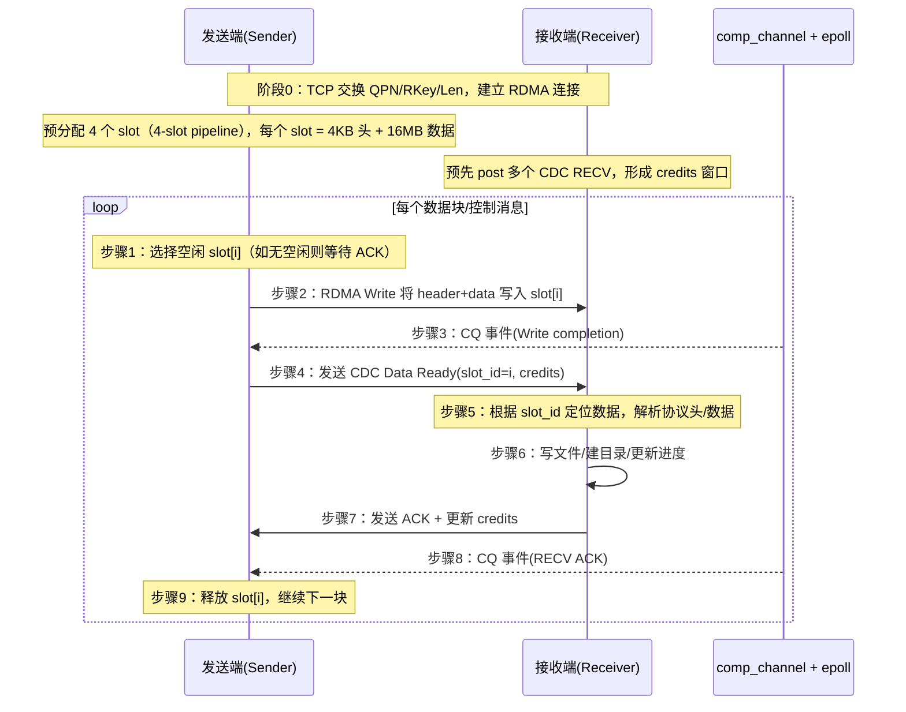

# scp_rdma - SCP over RDMA

## 工具：基于 RDMA 的高性能文件传输工具。
背景：在智算场景中，智算服务器之间通常由RDMA(RoCE、IB、iWARP)实现Scale Out通信，本项目的目的就是为了用RDMA协议栈完成跨服务器之间的文件/文件夹 的相互传递，在传输镜像以及模型权重等文件时能够更加迅速。

## 简介
结合实际的使用场景，本项目使用OOB(Socket)作为RDMA建链的方式，使用控制消息CDC(Connection Data Control)来通知接收端已完成write写入：
```bash
【问题】
发送端: RDMA Write 直接写入接收端内存
        ↓
接收端: 不知道数据什么时候到达！
【CDC 解决方案】
发送端: RDMA Write → 发送 CDC 信号 (post_send_cdc)
                           ↓
接收端: 收到 CDC → 知道数据已就绪，开始处理
                   处理完毕 → 发送 ACK (server_is_confirmed)
                           ↓
发送端: 收到 ACK → 知道接收端已处理完毕
```

项目主要包含了两个文件夹：
```bash
scp_rdma工具的主要实现在 scp_rdma文件夹下；rdma_trans_src只包含了socket+cdc的实现函数(如有需要可以联系我获得 rdma_cm 和 write with immediate的实现函数,这里暂未使用到)
```

## 快速开始

### 编译
```bash
cd scp_rdma
meson setup build
ninja -C build
```

### 安装到默认路径
如果不想安装到系统，默认编译生成到build路径下
```bash
cd build
./scp_rdma xx xx ..
```

### 安装到系统 
安装
```bash
chmod +x install.sh
./install.sh
```

卸载
```bash
./install.sh uninstall
```

### 自定义安装路径
```bash
./install.sh --prefix=$HOME/.local
```

## 使用方法

### 说明

由于rdma传输机制是直接传输到服务端（接收端）的内存中，为了安全起见，在服务端和客户端都设置了相对路径的功能.


**服务端 (接收文件):**

必须使用-s 表明为服务端，如果不使用 -o file_path 来指定发送来的文件保存在哪里，默认就当前目录 
```bash
scp_rdma -s 
```

可以使用 -o file_path 指定发来的文件保存在哪里(以 /tmp 为例，接受的文件保存到本机的 /tmp路径下)
```bash
scp_rdma -s -o /tmp
```

**客户端 (发送文件):**

可以传输单独文件(比如压缩包等，不需要使用 -r 参数)，如果传输数据类型的为文件夹，则必须指定 -r 参数：
```bash
scp_rdma <本地文件> <服务器IP>:<远程路径>

# 示例
scp_rdma myfile.txt 192.168.1.100:/test/
scp_rdma -r /home/test/file 192.168.1.100:/test/  # 递归传输目录
```
上面的192.168.1.100:/test/中 :/test/的作用也是为了指定保存的路径：

比如服务端设置了保存的路径为/tmp, 这里发送端指定了 /test/,那么最终文件在服务端保持的路径为 /tmp/test/myfile.txt

如果客户端不想做路径的修改，可以直接使用 ":"
```bash
# 示例
scp_rdma myfile.txt 192.168.1.100:
scp_rdma -r /home/test/file 192.168.1.100:  # 递归传输目录
```

## 选项

###  用户还可以指定使用哪张rdma网卡，以及接听的端口号

| 选项 | 说明 |
|------|------|
| `-s` | 服务端模式 |
| `-r` | 递归传输目录 |
| `-d <dev>` | 指定 RDMA 设备名 |
| `-p <port>` | TCP 端口 (默认 1777) |
| `-o <dir>` | 接收文件输出目录 |
| `-v` | 详细输出 |
| `-h` | 显示帮助 |

### 使用示例

接收端：


发送端：


## 新增技术
在保持整体使用方式不变的前提下，本版本新增了面向大文件与高并发场景的性能优化与稳定性增强：
- 异步完成通知：CQ 绑定 comp_channel + epoll，事件驱动收割 completion，避免忙轮询。
- 4-slot 多缓冲流水线：单次会话预分配 4 个数据槽位并复用 MR，提升吞吐并减少频繁分配。
- CDC 信号增强：使用 slot_id + credits 进行 ACK 与流控，降低发送端阻塞概率。
- O_DIRECT 零拷贝优化：4KB 对齐缓冲区配合直接 I/O，失败自动回退到普通读，兼顾性能与兼容性。
- 持久会话与资源复用：首次握手完成后复用缓冲区与连接，减少多文件传输的初始化开销。

### 技术示意图


### 4-slot 流水线示意
```mermaid
flowchart LR
  subgraph Time[时间 →]
    T0[批次 n] --> T1[批次 n+1] --> T2[批次 n+2] --> T3[批次 n+3]
  end

  subgraph Slots[4 个 slot 轮转]
    S0[slot0] --> S1[slot1] --> S2[slot2] --> S3[slot3] --> S0
  end

  subgraph Pipeline[流水线并行（slot 可乱序完成）]

    S0W[slot0: RDMA Write] --> S0C[slot0: 发送 CDC] --> S1W[slot1: RDMA Write] --> S1C[slot1: 发送 CDC] --> S0A[slot0: 接收 ACK(释放slot0)] ...（接下一行）
        --> S2W[slot2: RDMA Write] --> S2C[slot2: 发送 CDC] --> S1A[slot1: 接收 ACK(释放slot1)] --> S3W[slot3: RDMA Write] --> S3C[slot3: 发送 CDC]...(接下一行)
        --> S0W[slot0: RDMA Write] --> S0C[slot0: 发送 CDC] --> S2A[slot2: 接收 ACK(释放slot2)] --> S3A[slot3: 接收 ACK(释放slot3)] ... 

  end

  S0W 表示 slot0的write操作
  S0C 表示 slot0发送CDC的动作
  S0A 表示 slot0接受ACK的动作

  -. 异步推进：CDC 后不等待 ACK，直接切换下一个 slot .- S1W，只有ACK回来后才会释放slot进行下一次write传输，如果slot没被释放，跳过当前slot查看下一个slot是否可用 - 
```

补充说明：
- 流水线深度：3 段（`RDMA Write` → `CDC Data Ready` → `ACK`）。
- 流水线长度：4 个 slot（`slot0~slot3`），稳态时最多 4 个数据块在途。
- 单个 slot 结构：4KB 头部 + 16MB 数据块（`SCP_DATA_OFFSET=4096`，`SCP_CHUNK_SIZE=16MB`）。
- 吞吐行为：进入稳态后，每收到 1 个 ACK 释放 1 个 slot，发送端即可复用该 slot 继续写下一块。
- 流控细节：`credits` 控制可发送的 CDC 数量，防止接收端 RECV 队列耗尽导致阻塞。
- 异步特征：每个 slot 在完成 `CDC Data Ready` 后**不等待 ACK**，立即切换到下一个空闲 slot 继续写；ACK 到达时再异步释放对应 slot。

